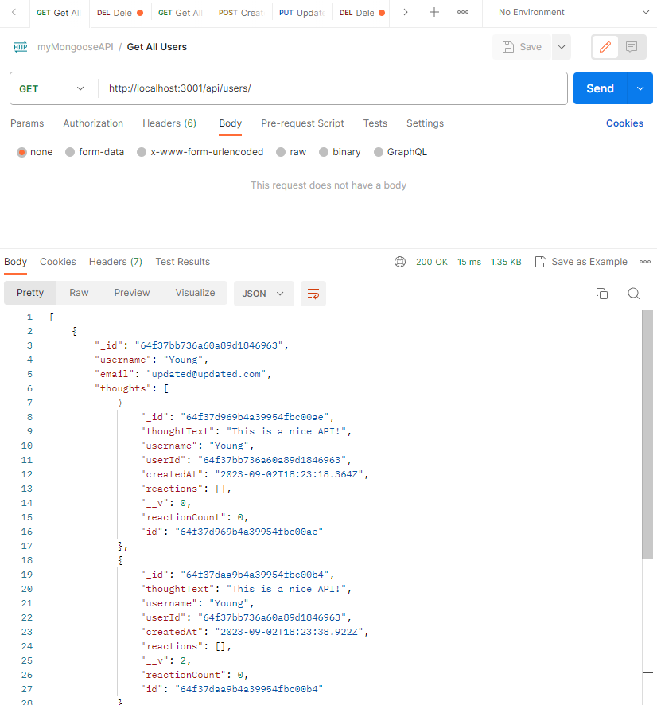

## Check out this app's demonstration video here: https://drive.google.com/file/d/1J-COnI6ynS2DWhnQKx571KWLOENTPXTP/view

---

  

---

# myMongooseAPI

## Description



This is an Express.js application with Mongoose for managing users, thoughts, and their reactions. It uses MongoDB for database and api platform such as Insomnia/Postman for testing api endpoints. It can be used to create, read, update, and delete users, thoughts, and reactions. There's no seed file, so you need to create your own data.

---

## Table of Contents

- [Installation](#installation)
- [Usage](#usage)
- [Endpoint](#endpoint)
- [Credits](#credits)
- [License](#license)
- [Contributing](#contributing)
- [Questions](#questions)

---

## Installation

You can simply download/clone the app from its repo to install.

To clone, run the following command in your terminal:

```
   git clone https://github.com/jyoungjoon/myMongooseAPI.git
```

To download: Simply click on the download button on the repository on browser and extract.

---

## Usage

After installation, you need to make sure that your MongoDB server is running and is connected to your local machine. If you don't have MongoDB installed, you can download it from [here](https://www.mongodb.com/try/download/community). Once after you have MongoDB installed and running, you will want to check "config/connection.js" file to make sure that the connection is correct before running the app.

```
connect('mongodb://127.0.0.1:27017/myMongooseAPI', {
  useNewUrlParser: true,
  useUnifiedTopology: true,
});
```

Then, install all the dependencies by running the following code in your terminal:

```
   npm install
```

Then, you need to start the server by running the following code in your terminal:

```
   npm start
```

Then, you can use Insomnia or any other api platform (Postman, etc.) to test api endpoints. See 'routes.js' file for complete api endpoints.

---

## Endpoint

### Example

#### Get All Products

- **Route:** `/api/users`
- **Method:** `GET`

**Example Request:**

```
GET localhost:3001/api/users
```

**Example Response:**

```
[
    {
        "_id": "64f37bb736a60a89d1846963",
        "username": "Young",
        "email": "updated@updated.com",
        "thoughts": [
            {
                "_id": "64f37d969b4a39954fbc00ae",
                "thoughtText": "This is a nice API!",
                "username": "Young",
                "userId": "64f37bb736a60a89d1846963",
                "createdAt": "2023-09-02T18:23:18.364Z",
                "reactions": [],
                "__v": 0,
                "reactionCount": 0,
                "id": "64f37d969b4a39954fbc00ae"
            },
            {
                "_id": "64f37daa9b4a39954fbc00b4",
                "thoughtText": "This is a nice API!",
                "username": "Young",
                "userId": "64f37bb736a60a89d1846963",
                "createdAt": "2023-09-02T18:23:38.922Z",
                "reactions": [],
                "__v": 2,
                "reactionCount": 0,
                "id": "64f37daa9b4a39954fbc00b4"
            }
        ],
        "friends": [],
        "__v": 6,
        "friendCount": 0,
        "id": "64f37bb736a60a89d1846963"
    },
    {
        "_id": "64f37c2f9b4a39954fbc0093",
        "username": "Adriana",
        "email": "adriana@adriana.com",
        "thoughts": [],
        "friends": [],
        "__v": 0,
        "friendCount": 0,
        "id": "64f37c2f9b4a39954fbc0093"
    },
    {
        "_id": "64f37c589b4a39954fbc0099",
        "username": "Test",
        "email": "test@test.com",
        "thoughts": [],
        "friends": [],
        "__v": 0,
        "friendCount": 0,
        "id": "64f37c589b4a39954fbc0099"
    },
    {
        "_id": "64f37c6a9b4a39954fbc009b",
        "username": "Delete Me",
        "email": "DeleteMe@deleteme.com",
        "thoughts": [],
        "friends": [],
        "__v": 0,
        "friendCount": 0,
        "id": "64f37c6a9b4a39954fbc009b"
    }
]
```

---

## License

This project is licensed under the MIT license.

---

## Credits

Thank you 2023 UC Berkeley Coding Bootcamp for providing mock up images.

---

## Contributing

Please email me for contributing instructions.

---

## Questions

Please email me or find me on Github for any questions or issues.

Find me on Github: [jyoungjoon](https://github.com/jyoungjoon)

You can also contact me at lifescriptified@gmail.com.

---
